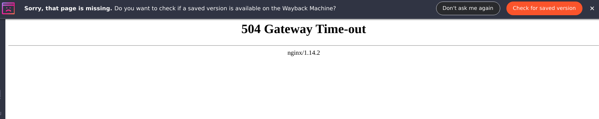
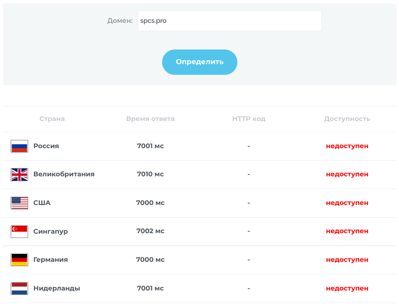

# Spacer / Parser for Spaces

Скрипт для скачивания файлов со [spaces.ru](https://spcs.pro)




:fire: Очевидно, что сракес давно на ладан дышит :fire: 

:sob:
Поэтому этот скрипт призван скачать нужные книги, фотографии, музыку и проги со сракеса.
А возможно, вы просто хотите забрать все файлы с ваших страниц на всякий случай. 
:broken_heart:



Опять шатают сайт. :trollface:

:herb: Скрипт скачивает файлы из разделов pictures, music, video, files пользователей, а так же коллекции из pictures, video, files. 
Так же скачивает из pictures, video, files, music сообществ. 
Он скачивает дневники в html с сохранением картинок и файлов из дневника. 
У пользователя под которым он зашёл на сайт может скачать закладки, почту, дневники, комментарии из гостевой и проч.

:tulip::cat2:


[Вопросы и пожелания писать сюда](mailto:aestas@airmail.cc)


## Команды

```bash
Usage: spacer.py [options]

Опции:
  -i FILE, --input=FILE                 Файл с логинами
  -A FILE, --auto-links=FILE 		Брать автовходы из файла
  -I LOGIN, --into-account=LOGIN 	Войти в аккаунт
  -R, --rotation-al     		Ротация автовходов
  -c, --comm            		Скачиваем из сообщества (По умолчанию - пользователь)
  -n, --nick            		Посмотреть никнэйм
  -s, --status          		Получить статус
  -a, --avatar          		Скачать аватар
  -b, --bookmarks       		Собрать закладки
  -g, --guestbook       		Всё забрать из гостевой
  --post                		Всё забрать из почты
  --diary               		Всё забрать из дневника
  -0 url, --one-element-html=url  	Скачиваем один элемент
  -P, --pictures        		Забираем фотографии
  -M, --music           		Забираем музыку
  -V, --video           		Забираем видео
  -F, --files           		Забираем файлы
  -p, --pictures-collection 		Собрать из коллекций фотографий
  -v, --video-collection 		Собрать из коллекций видео
  -f, --files-collection 		Собрать из коллекций файлов
  -1, --pictures-dir    		Забрать отдельную папку с подпапками из раздела pictures
  -2, --files-dir       		Забрать отдельную папку с подпапками из раздела files
  -3, --video-dir       		Забрать отдельную папку с подпапками из раздела video
  -4, --music-dir       		Забрать отдельную папку с подпапками из раздела music
  -r, --readers         		Забираем читателей
  -H, --history-login   		Смотрим историю входов на аккаунте
  -l, --likes           		Список того, что вы лайкали
  -C, --comm-list       		Список сообществ пользователей заданных списком аргументов
  --delete-bookmarks    		Удаляем закладки
  --delete-comment-guestbook 		Удаляем комменты из гостевой
```


## Примеры

```bash
# Смотрим хэлп
python3 spacer.py -h
```

### Обычные операции
---
#### Скачиваем музыку
```bash
python3 spacer.py -A autolinks.txt -I kapalua -M mirror75
```
---
#### Скачиваем картинки с 10 страниц из топа на главной странице
```bash
$p $e -A $f -I $u --pictures_top 10
```
---
#### Скачиваем картинки
```bash
python3 spacer.py -A autolinks.txt -I kapalua -P tzeentch
```
---
#### Скачиваем файлы
```bash
python3 spacer.py -A autolinks.txt -I kapalua -F Noire
```
---
#### Скачиваем картинки из указанного сообщества
```bash
python3 spacer.py -A autolinks.txt -I kapalua --comm -P mathematics
```
---
#### Файлы из сообщества
```bash
$p $e -A $f -I $u --comm -F mathematics
```
---
#### Скачиваем закладки у пользователя под которым зашли на сайт
```bash
$p $e -A $f -I $u -b
```


---
### Массовые операции
#### Скачиваем всё у пользователей из списка users.txt
```bash 
# Логин
u=kapalua
#Список автовходов
f=autolinks.txt
#Скрипт
e=spacer.py
#Питон
p=python3

# -P -p -F -f  -V -v -M
for c in $(cat users.txt)
do
	# Картинки
	$p $e -A $f -I $u -P $c
	# Колекции картинок
	$p $e -A $f -I $u -p $c
	# Файлы
	$p $e -A $f -I $u -F $c
	# Коллекции файлов
	$p $e -A $f -I $u -f $c
	# Видео
	$p $e -A $f -I $u -V $c
	# Коллекции видео
	$p $e -A $f -I $u -v $c
	# Музыка
	$p $e -A $f -I $u -M $c
done
```
---
#### Скачиваем всё из сообществ из списка comm.txt
```bash
for c in $(cat comm.txt)
do
	# Картинки
	$p $e -A $f -I $u --comm -P $c
	# Файлы
	$p $e -A $f -I $u --comm -F $c
	# Видео
	$p $e -A $f -I $u --comm -V $c
	# Музыка
	$p $e -A $f -I $u --comm -M $c
done
```
---
#### Обычные операции
```bash
# Скачиваем музыку
$p $e -A $f -I $u -M mirror75

# Скачиваем картинки
$p $e -A $f -I $u -P tzeentch

# Скачиваем файлы
$p $e -A $f -I $u -F kapalua

# Скачиваем картинки из указанного сообщества
$p $e -A $f -I $u --comm -P love_3hakomctba
```

---
#### Массовые операции
```bash
# Скачиваем всё у пользователей 
# -P -p -F -f  -V -v -M
for c in $(cat tmp/users.txt)
do
	# Картинки
	$p $e -A $f -I $u -P $c
	# Колекции картинок
	$p $e -A $f -I $u -p $c
	# Файлы
	$p $e -A $f -I $u -F $c
	# Коллекции файлов
	$p $e -A $f -I $u -f $c
	# Видео
	$p $e -A $f -I $u -V $c
	# Коллекции видео
	$p $e -A $f -I $u -v $c
	# Музыка
	$p $e -A $f -I $u -M $c
done
```
```bash
# Скачиваем всё в сообществах
for c in $(cat tmp/comm.txt)
do
	# Картинки
	$p $e -A $f -I $u --comm -P $c
	# Файлы
	$p $e -A $f -I $u --comm -F $c
	# Видео
	$p $e -A $f -I $u --comm -V $c
	# Музыка
	$p $e -A $f -I $u --comm -M $c
done
```

#### Примеры различных операций
```bash
# Статусы
$p $e -A $f -I $u -s $user > spcs.pro/$user/status.txt
# Скачиваем всё из почты 
$p $e -A $f -I $u --post 
# Скачиваем всё из дневника
$p $e -A $f -I $u --diary $user
# Скачиваем из гостевой
$p $e -A $f -I $u --guestbook $user
# Закладки
$p $e -A $f -I $u -b
# Лайки
$p $e -A $f -I $u -l > spcs.pro/$user/likes.txt
# Аватарки
$p $e -A $f -I $u -a $user
# Картинки
$p $e -A $f -I $u -P $user
# Коллекции картинок
$p $e -A $f -I $u  -p $user
# Скачиваем файлы
$p $e -A $f -I $u -F $user
# Коллекции файлов
$p $e -A $f -I $u -f $user
# Сообщества
$p $e -A $f -I $u -C $user > spcs.pro/$user/comm.txt
# Скачиваем видео
$p $e -A $f -I $u -V $user
# Коллекции видео
$p $e -A $f -I $u -v $c
# Читаки
$p $e -A $f -I $u -r $user > spcs.pro/$user/readers.txt
# Музыка
$p $e -A $f -I $u -M $user
# История входов
$p $e -A $f -I $u -H > spcs.pro/$user/history_logins.txt
# Скачиваем страницу с подарками пользователя $user
$p $e -A $f -I $u -0 "https://spcs.pro/gifts/user_list/$user/"
# Скачиваем страницу с действиями пользователя с монетами 
$p $e -A $f -I $u -0 "https://spcs.pro/services/journal/"
# Скачиваем отдельную папку с подпапками из картинок
$p $e -A $f -I $u -1 "https://spcs.pro/pictures/user/ulybkadozhdya/list/jumor/ubojnyj-jumor-16568083/"
# Скачиваем отдельную папку с подпапками из музыки
$p $e -A $f -I $u -4 "https://spcs.pro/music/user/mirror75/list/trance-iv/va-sapphire-planet-trance-october-2011-812300/"
# Удаляем закладки
$p $e -A $f -I $u --delete-bookmarks
# Удаляем комментарии из гостевой
$p $e -A $f -I $u --delete-comment-guestbook
# Скачиваем картинки из сообщества
$p $e -A $f -I $u --comm -P math
# Скачиваем картинки с 25 страниц из топа на главной странице
$p $e -A $f -I $u --pictures_top 25

```

#### Множество операций для списка аккаунтов
```bash
make
# Логин
u=my_login
# Список автовходов
f=autolinks.txt
# Скрипт
e=spacer.py
# Питон
p=python3
# Адрес сайта
baseurl=spcs.pro

# Список юзеров у которых хотим скачать
users=(user1 user2 user3 user4)

for user in ${users[@]}
do
	# Главная страница пользователя $user
	$p $e -A $f -I $u -0 "https://$baseurl/mysite/index/$user/"
	# Анкета пользователя $user
	$p $e -A $f -I $u -0 "https://$baseurl/anketa/index/$user/"
	# Страница из дневника пользователя $user
	$p $e -A $f -I $u -0 "https://$baseurl/diary/view/user/$user/"
	# Скачиваем страницу с подарками пользователя $user
	$p $e -A $f -I $u -0 "https://$baseurl/gifts/user_list/$user/"
	# Страница списка тем форума пользователя $user
	$p $e -A $f -I $u -0 "https://$baseurl/forums/search_user/?query=$user"
	# Список комментариев пользователя в форуме пользователя $user
	$p $e -A $f -I $u -0 "https://$baseurl/forums/search_user/?Comment=1&query=$user"
	# Читатели пользователя $user
	$p $e -A $f -I $u -0 "https://$baseurl/lenta/readers/?user=$user"
	# Сообщества пользователя $user
	$p $e -A $f -I $u -0 "https://$baseurl/comm/list/user/$user/"
	# Скачиваем всё из дневника пользователя $user
	$p $e -A $f -I $u --diary $user
	# Скачиваем из гостевой пользователя $user
	$p $e -A $f -I $u --guestbook $user

	# Скачиваем аватарку пользователя $user 
	$p $e -A $f -I $u -a $user
	# Картинки пользователя $user
	$p $e -A $f -I $u -P $user
	# Коллекции картинок пользователя $user
	$p $e -A $f -I $u  -p $user
	# Скачиваем файлы пользователя $user
	$p $e -A $f -I $u -F $user
	# Коллекции файлов пользователя $user
	$p $e -A $f -I $u -f $user
	# Скачиваем видео пользователя $user
	$p $e -A $f -I $u -V $user
	# Коллекции видео пользователя $user 
	$p $e -A $f -I $u -v $user
	# Музыка пользователя $user
	$p $e -A $f -I $u -M $user

done
```


